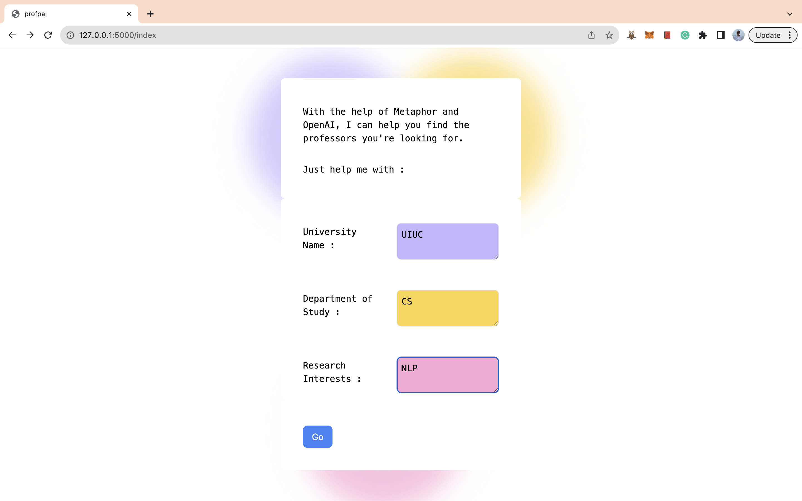
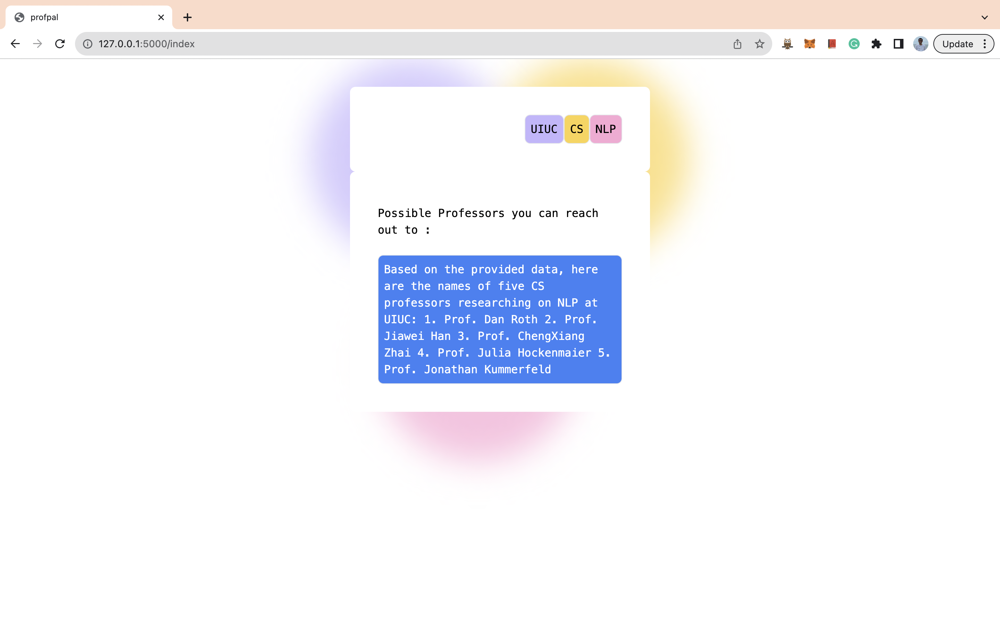

# profpal

Hi, I'm profpal - an AI assistant written in Python (Flask) built with Metaphor and OpenAI and I help students (mostly master's, PhDs, and enthusiastic undergrads) find professors in their respective research fields of interest :)
<be>  

 
To help you find professors, I request three fields on input from your end: 
1. Name of University (Ex: UIUC, Princeton)  
2. Department of Study (Ex: CS, EE)  
3. Research Interests (Ex: NLP, CV)    

 
Then, I search for URLs all over the Internet with Metaphor API to find professors of your interest hidden in different corners of the World Wide Web.  
After that, I use the extracted information from the relevant URLs and hand it over to my LLM pal (OpenAI in this instance) who makes sense of the data and tells me all about it.  
Lastly, I give you the names of possible professors you can reach out to pursue your research interests and shine bright in the world of academia.    

 
Hope I helped you a wee bit. In case of queries reach out to: **mihirpamnani31@gmail.com**  

[Note: This is my submission for the first assessment at Metaphor AI]

